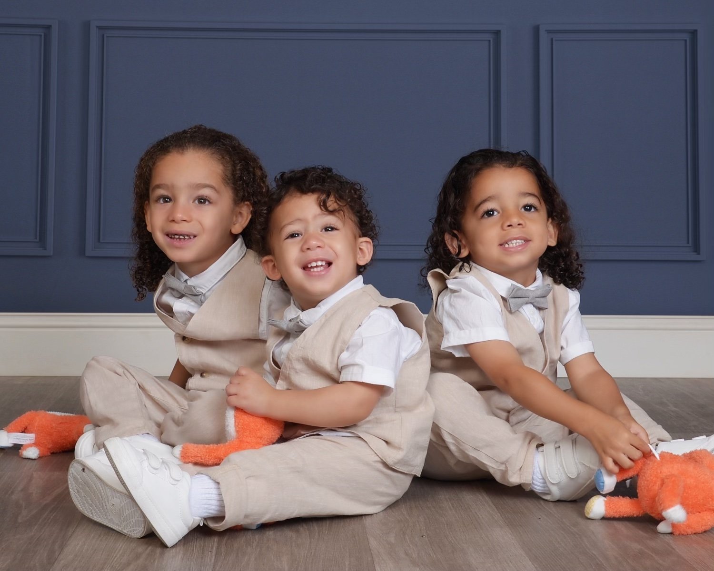

### PhD Candidate at Columbia University (current role)

Rae Spriggs (she/her) is a third-year Environmental Health Sciences doctoral candidate at Columbia Mailman School of Public Health. Her research sits at intersection of extreme climate exposures, social vulnerability (racial and ethnic composition, historical environmental injustice, and pollution burden), and mental health outcomes. She works under the mentorship of Dr. Robbie M. Parks and Dr. Annie Nigra. 

Her previous project with Dr. Nigra explores and characterizes multiple environmental exposures (drinking water quality, extreme heat, air pollution, etc.) impacting U.S. correctional facilities. Manuscript in progress!

Her dissertation research with Dr. Parks is evaluating spatiotemporal trends in mental health-related mortality in response to extreme climate exposures such as tropical cyclones and wildfires. 

### Educational background

* Environmental Health Sciences MPH - University of California, Los Angeles (2019) 
* BA in Public Health - University of California, Berkeley (2016)

### Previous professional appointments

* Manager of Climate Action Research - UCLA Luskin Center for Innovation (2022)
* Associate Director - UCLA Center for Diverse Leadership in Science (2019-2022)
* Climate and Equity Researcher - The Environment Initiatives Hub at the Nonprofit Institute (2018-2019)
* Graduate Student Researcher - Health Impact Assessment Group at the UCLA School of Public Health (2017-2018)
* Climate Change and Health Equity Research Assistant - San Diego County Health and Human Services Agency (2017)
* Alumni Outreach Coordinator - FACES for the Future (2016-2017)

### Fun facts 

* Rae has three beautiful nephews. They are her favorite humans, hands down.
* Rae is originally from San Diego, CA, home of the superior weather. She can't wait to move back!
* Rae wants to visit all seven continents. South America is up next (ISEE 2024)!
* Rae likes writing, checking out standup comedy, and singing karaoke in her spare time. 
* Rae is still friends with her third grade teacher.
* Rae is co-organizing an Urban Health Dialogue Series with a couple EHS peers at Columbia.

### Rae's nephews (they deserve their own section)

